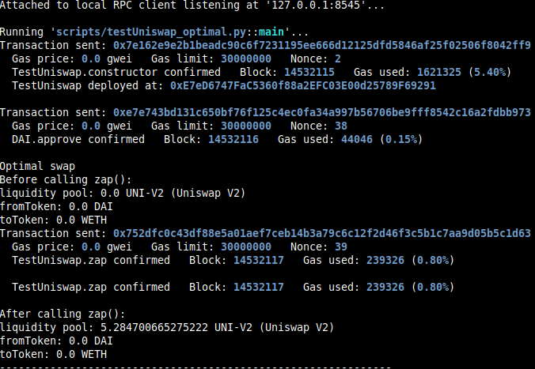

Study case of the Uniswap contracts and functions, from [Solidity by Example site, Uniswap V2 Swap](https://solidity-by-example.org/defi/uniswap-v2/)

I use brownie to compile and deploy into hardhat in order to have the console.log feature.
You should start the hardhat node in another terminal and folder (`hh node`), then, in a terminal :

```bash
brownie compile
brownie run scripts/script.py
```

Four brownie scripts are demonstrating different operations on Uniswap V2 contracts:
testUniswap_swap.py demonstrates the swap of tokens in Uniswap V2.
testUniswap_liquidity.py deals with adding and removing liquidity from Uniswap liquidity pools.
testUniswap_optimal.py deals with optimisation of amounts for swapping
testUniswap_optimal.py deals with suboptimal way of inputing the amounts for swapping.

After deploying from brownie :
Liquidity swap:

Adding/removing liquidity:

SubOptimal Swap:

Optimal Swap:

